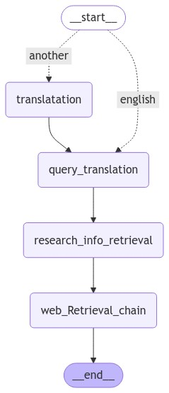

# 🎥 Video Transcription & Multi-Agent Q&A System with LangGraph

This project offers a robust pipeline for transcribing YouTube videos and enabling advanced question-answering (QA) about their content using a **LangGraph-based multi-agent system**. It combines **audio transcription (Whisper)**, **vector-based retrieval (Pinecone)**, and **web augmentation (Tavily)** to provide enriched, real-time answers to user queries.

---

## 🧠 Key Features

- 🔗 **YouTube Integration**: Accepts any video URL, downloads, and extracts audio.
- 🧏 **Transcription via Whisper**: Uses OpenAI Whisper for accurate multi-language transcription.
- 🧠 **RAG-based QA**: Uses Retrieval-Augmented Generation (RAG) to answer questions based on video content.
- 🌍 **Web Search Augmentation**: Enhances responses using **Tavily API** for up-to-date information.
- 🕸️ **LangGraph Multi-Agent Flow**: Modular agents for translation, retrieval, and synthesis.
- ✨ **Prompt Engineering**: Custom prompts to optimize understanding and responses.

---

## 🖼️ System Overview

The following LangGraph workflow illustrates the pipeline:

 

**LangGraph Nodes:**

- `__start__` → `translatation` (if non-English)
- `query_translation`: Normalize the question
- `research_info_retrieval`: Retrieve from transcription using RAG
- `web_Retrieval_chain`: Retrieve from Tavily web
- `__end__`: Final answer generation

Each state is maintained in a `GraphState` like below:

```python
class GraphState(TypedDict):
    initial_query: str
    query_language: str
    final_query: str
    new_query: str
    Rag_search: str
    web_research: str
    context: str
    final_answer: str
```
---

## 🧠 System Overview

```
         ┌────────────┐
         │ YouTube URL│
         └─────┬──────┘
               ▼
      ┌─────────────────────┐
      │ Download & Audio    │
      │ Extraction          │
      └─────┬───────────────┘
            ▼
    ┌────────────────────────┐
    │ Whisper Transcriber    │
    └─────┬──────────────────┘
          ▼
    ┌────────────────────────┐
    │ Chunk & Embed Text     │
    └────┬───────────────────┘
         ▼
   ┌────────────────────────┐
   │ Store in Pinecone      │
   └────────┬───────────────┘
            ▼
     ┌──────────────────────┐
     │ LangGraph Agents     │
     └────────┬─────────────┘
              ▼
     ┌──────────────────────┐
     │   Start State        │
     └────────┬─────────────┘
              ▼
     ┌──────────────────────┐
     │  Language Detection  │
     └────────┬─────────────┘
     ┌────────▼─────────────┐
     │ if not English       │
     │ → Translation Agent  │◄──┐
     └────────┬─────────────┘   │
              ▼                 │
     ┌──────────────────────┐   │
     │ Query Translation    │───┘
     └────────┬─────────────┘
              ▼
     ┌────────────────────────────┐
     │ RAG Search (Pinecone)      │◄─── Retrieves from video
     └────────┬───────────────────┘
              ▼
     ┌────────────────────────────┐
     │ Tavily Web Search Agent    │◄─── Augments from web
     └────────┬───────────────────┘
              ▼
     ┌────────────────────────────┐
     │ Final Answer Generation    │
     └────────┬───────────────────┘
              ▼
     ┌────────────────────────────┐
     │        ⛳ Final Answer      │
     └────────────────────────────┘

```

---

## 📦 Installation

1. **Clone the repository**

```bash
git clone https://github.com/yourusername/video-qa.git
cd video-qa
```

2. **Install dependencies**

```bash
pip install -e .
```

3. **Configure environment variables**

```bash
cp .env.example .env
```

Update `.env` with your credentials:

* `GROQ_API_KEY`
* `PINECONE_API_KEY`
* `TAVILY_API_KEY`

---


## 🗂 Project Structure

```
project/
├── data/               # Raw and processed data
├── notebooks/          # Reference notebooks
├── src/                # Core source code
│   ├── __init__.py
│   ├── data/           # Data handling
│   ├── models/         # LangGraph agents and prompts
│   ├── utils/          # Helper utilities
│   └── visualization/  # Optional visualization tools
├── tests/              # Unit and integration tests
├── README.md           # Project documentation
├── requirements.txt    # Python dependencies
└── setup.py            # Packaging info
```

---

## 🔧 Tech Stack

* **LangGraph** – Multi-agent workflow coordination
* **Whisper** – Automatic Speech Recognition (ASR)
* **Pinecone** – Vector database for fast semantic search
* **Tavily API** – Live web search augmentation
* **OpenAI / GROQ** – Language models for answer generation
* **FFmpeg** – Audio processing

---

## 📜 License

This project is licensed under the [MIT License](LICENSE).
Feel free to use, modify, and distribute it with attribution.

---


## 📬 Contact

For any inquiries or collaborations, please reach out via GitHub or \[[omarabdelnasser313@gmail.com](omarabdelnasser313@gmail.com)].

---

